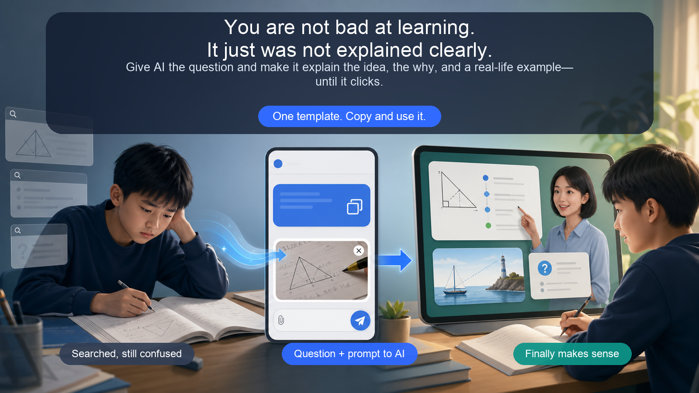

<div align="center">

**🌐 English ｜ [中文](./README.md)**

# You are not bad at learning. It just was not explained clearly.

Give AI the question and make it explain the plain-language idea, the why, and a real-life example—until it clicks.



**One template. Copy and use it immediately.**

</div>

---

> Abstract subjects such as mathematics and physics are often difficult not because answers are hard to find, but because no teacher is nearby to explain **why a formula is used or how each step follows from the last.**

## When No Teacher Is Nearby

- **Students learning on their own**: When an abstract idea or difficult problem does not make sense and no teacher is available, one missing concept can block everything that follows.
- **Parents helping their children**: They want to help, but may not know where the child is stuck or how to explain a complex idea simply.
- **One simple prompt can help**: Copy the template below, paste the question or upload a screenshot, and let AI act like an always-available one-to-one tutor. It finds the gap first, then explains with plain language, real-life examples, and step-by-step reasoning until the idea clicks.

## ⭐ One Core Prompt

Copy the full prompt and replace the `【】` fields:

```text
Please help me like a patient one-to-one tutor.

I am studying 【subject / topic】, and this is where I am stuck:
【paste the problem, concept, or passage, or attach a screenshot】

Do not just give me the answer. Instead:
1. Identify the concept being tested and where I may be stuck;
2. Explain the “why” step by step in plain language without skipping reasoning;
3. Give me one simple real-life analogy that builds intuition;
4. If I say “I still don't get it,” explain only the confusing step in a different way;
5. Ask me to explain it back, then give me one short check question.
```

Use it with ChatGPT, Claude, DeepSeek, Gemini, Copilot, or another conversational AI.

## How to Use It in 30 Seconds

1. Copy the prompt above;
2. Add your question or attach a screenshot;
3. Point to the step that still does not click and keep asking until you can explain it back.

## Why It Feels More Like a Tutor

- **Find the gap first**: identify what you do not understand before revealing the answer;
- **Teach it differently**: combine plain language, steps, and a real-life analogy;
- **Check understanding**: ask you to explain it back and solve one short question.

## License

[MIT](./LICENSE) — use it, adapt it, and share it freely. If this prompt helps one idea finally click, a ⭐ is appreciated.
