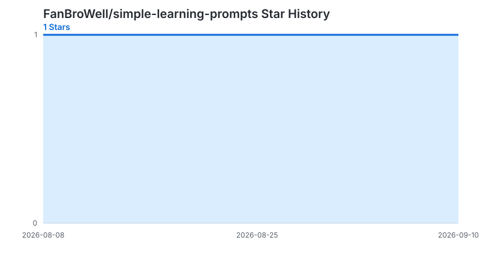

<div align="center">

**🌐 [English](./README.en.md) ｜ 中文**

# 不是你学不会，是一直没人把它讲明白。

把题目丢给 AI，让它用大白话、生活例子和“为什么”，一直讲到你懂。


**一个模板，复制就能用。**

</div>

---

> 数学、物理等知识越抽象，真正困难的往往不是找不到答案，而是没人告诉你：**这个公式为什么这样用，这一步为什么这样推。**

## 当身边没有老师时

- **学生自己学习**：遇到抽象概念或复杂题目，老师不在身边，一个知识点没弄懂，后面的内容也可能全部卡住。
- **家长辅导孩子**：想帮助孩子，却很难判断孩子究竟卡在哪里，也不知道怎样把复杂知识解释得简单易懂。
- **一个 Prompt 就能帮上忙**：复制下面的模板，粘贴题目或上传截图，让 AI 像一位随时在线的一对一老师，先找到卡点，再用大白话、生活例子和分步推导反复讲解，直到真正听懂。

## ⭐ 一个核心 Prompt

复制整段，把 `【】` 换成你的内容：

```text
请像一位耐心的一对一老师一样帮助我。

我正在学习【科目 / 主题】，这是我遇到的问题：
【粘贴题目、概念或段落，也可以直接上传截图】

请不要只给答案，而是：
1. 先告诉我它考查什么知识点，并判断我可能卡在哪里；
2. 用大白话一步一步解释“为什么”，不要跳步骤；
3. 配一个简单的生活例子，帮我建立直觉；
4. 如果我说“还是没懂”，请换一种说法，只讲我卡住的那一点；
5. 最后让我用自己的话复述，并给一道很短的检查题。
```

可用于 ChatGPT、Claude、DeepSeek、Gemini、豆包、通义等对话式 AI。

## 30 秒怎么用

1. 复制上面的 Prompt；
2. 填入问题，或直接上传题目截图；
3. 哪里没懂就指出哪里，继续追问到能自己复述。

## 为什么它更像老师

- **先找卡点**：不急着报答案，先判断你哪里没懂；
- **换方法讲**：大白话、步骤和生活例子一起解释；
- **检查理解**：让你复述，再用一道小题确认真的会了。

## License

[MIT](./LICENSE) — 可以自由使用、修改和分享。如果这个 Prompt 帮你讲懂了一个问题，欢迎点个 ⭐。

---

## 🌟 Star History

[](https://github.com/FanBroWell/simple-learning-prompts/stargazers)

[](https://github.com/FanBroWell/simple-learning-prompts/stargazers)

曲线由 GitHub Actions 每日自动更新。

如果这个项目对你有帮助，**点个 Star 让更多人看到** ⭐
