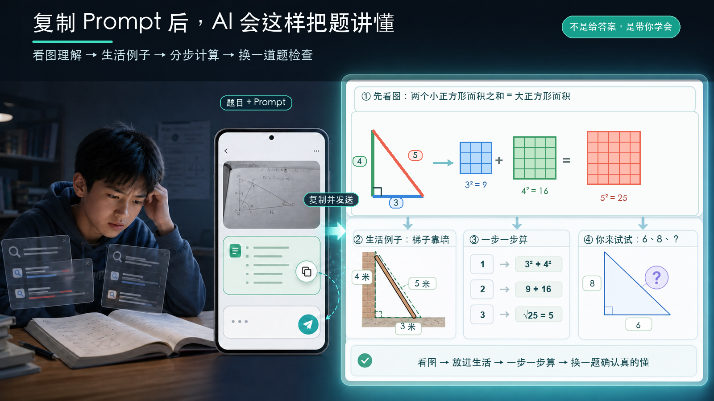

<div align="center">

**🌐 [English](./README.en.md) ｜ 中文**

# 不是你学不会，是一直没人把它讲明白。

把题目丢给 AI，让它用大白话、生活例子和“为什么”，一直讲到你懂。



**一个模板，复制就能用。**

</div>

---

> **这不是又一个 Prompt 合集。** 它只解决一个问题：学习卡住、身边没人能问时，让 AI 像老师一样把眼前这个知识点讲明白。

## 你可能正在经历

- 搜到答案了，却还是不知道“为什么”；
- 教学视频太长，找不到自己卡住的那一步；
- AI 第一次没讲懂，却不知道应该怎样继续追问。

## ⭐ 一个核心 Prompt

复制整段，把 `【】` 换成你的内容：

```text
请像一位耐心的一对一老师一样帮助我。

我正在学习【科目 / 主题】，这是我遇到的问题：
【粘贴题目、概念或段落，也可以直接上传截图】

请不要只给答案，而是：
1. 先告诉我它考查什么知识点，并判断我可能卡在哪里；
2. 用大白话一步一步解释“为什么”，不要跳步骤；
3. 配一个简单的生活例子，帮我建立直觉；
4. 如果我说“还是没懂”，请换一种说法，只讲我卡住的那一点；
5. 最后让我用自己的话复述，并给一道很短的检查题。
```

可用于 ChatGPT、Claude、DeepSeek、Gemini、豆包、通义等对话式 AI。

## 30 秒怎么用

1. 复制上面的 Prompt；
2. 填入问题，或直接上传题目截图；
3. 哪里没懂就指出哪里，继续追问到能自己复述。

## 为什么它更像老师

- **先找卡点**：不急着报答案，先判断你哪里没懂；
- **换方法讲**：大白话、步骤和生活例子一起解释；
- **检查理解**：让你复述，再用一道小题确认真的会了。

## License

[MIT](./LICENSE) — 可以自由使用、修改和分享。如果这个 Prompt 帮你讲懂了一个问题，欢迎点个 ⭐。
